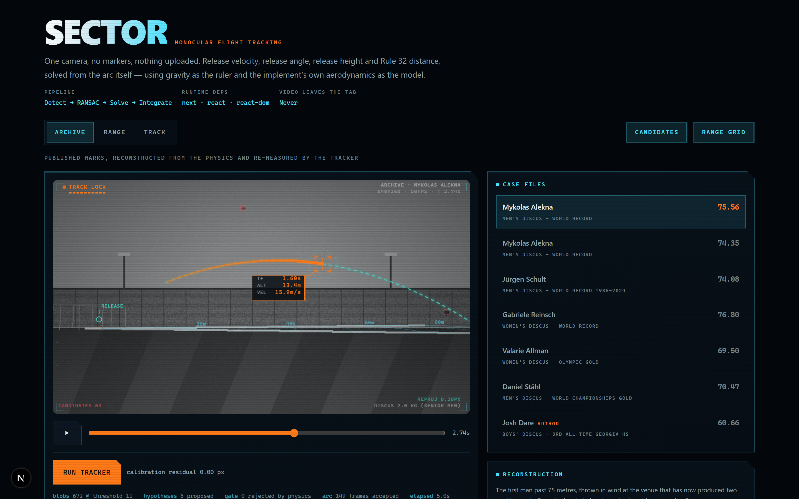
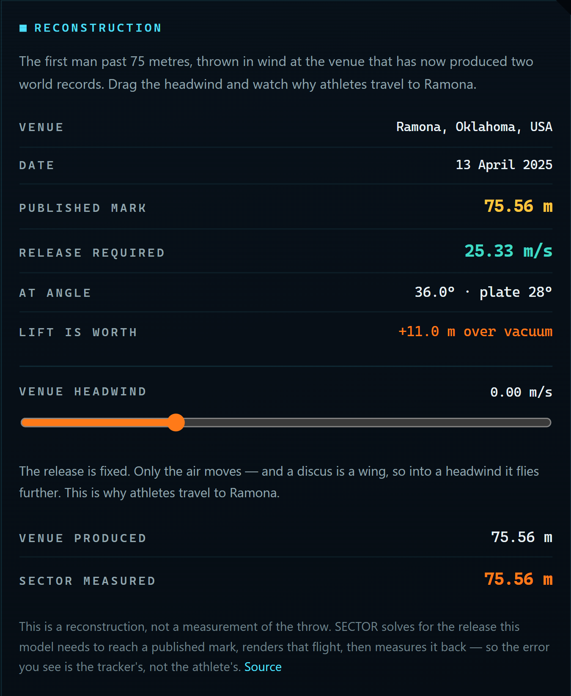
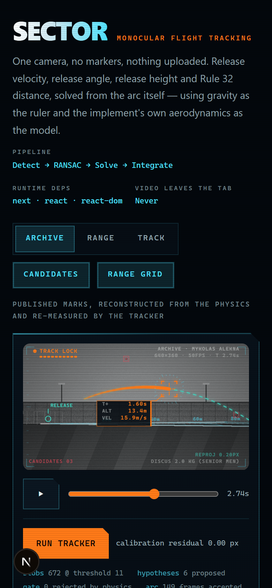

# SECTOR

**Monocular flight tracking and release analytics for the throwing events.**

**[Live demo → sector-ochre.vercel.app](https://sector-ochre.vercel.app)** · no signup, no upload — press **Run tracker** and watch it lock on.

One camera. No markers, no sensors, nothing uploaded. Point a phone at the ring, click four points on the rim, and SECTOR recovers the release velocity, release angle, release height, sector deviation and Rule 32 distance — from the arc itself, using gravity as the ruler and the implement's own aerodynamics as the model.



---

## Why this exists

A discus coach has two numbers after a throw: how far it went, and a stopwatch guess at everything else. The things that actually decide the distance — how fast it left the hand, at what angle, from what height, at what plate attitude — are invisible without a $20k optical system or a motion-capture lab.

But those numbers are already in the video. A thrown implement is a body in free flight with known mass and known drag. If you can find its pixels across enough frames and you know where the camera is, the physics is over-determined: there is exactly one release state that produces that arc. SECTOR solves for it.

## Three modes, one pipeline

| | |
|---|---|
| **Archive** | Published marks — world records, Olympic golds — reconstructed from the physics and re-measured by the tracker |
| **Range** | Design a release on sliders. The venue simulates and renders it; the analyser sees only pixels |
| **Track** | Your own footage, decoded and analysed in the tab |

All three hand their frames to the same `analyze()` behind one `FrameSource` interface. There is no demo code path that could quietly diverge from the real one, which is the only reason the error numbers mean anything.

## What the overlay is showing you

The HUD is a diagnostic wearing a reticle, not a reticle painted over a video. Colour is semantic and nothing is drawn for decoration:

- **amber** — what the system *saw in pixels*: the accepted arc points, fading behind the tracked head
- **cyan** — what the system *solved in metres*: the fitted flight projected back onto the image, the release and landing marks, and the range grid laid on the ground plane
- **red** — what it *threw out*: candidate blobs the trajectory fit refused, crossed through
- **gold** — what a *human clicked*: your four calibration points

The reticle runs a state machine — `STANDBY → SCANNING → ACQUIRING → TRACK LOCK → FLIGHT RESOLVED` — and its brackets close as the tracker gains confidence. The telemetry tag riding alongside the implement reads altitude and velocity off the solved world path, not off a canned animation.

That is also why the range grid earns its place: it is projected with the *solved* camera, so a grid that lands on the painted sector lines is itself evidence the calibration is good. When the cyan flight lies on top of the amber trail, the solve is honest — and when it does not, you can see that too.

## What it measures

| | |
|---|---|
| Release velocity | m/s at the instant of release |
| Release angle | degrees above horizontal |
| **Release height** | **measured, not assumed** — see below |
| Plate attitude | angle of attack inferred from the lift the flight actually generated |
| Sector deviation | degrees off the centreline, signed, with a legal/illegal call |
| Official distance | Rule 32 — circle inside edge to the mark, not release-to-landing |
| Aero efficiency | measured range ÷ vacuum range for the same release |
| Optimal angle | and how many degrees the athlete was off it |
| Wind counterfactual | the same release under different headwinds |

Release height being *measured* is the part most tools get wrong. Everyone else asks for the athlete's height and adds an offset. SECTOR never receives it: gravity fixes the scale of the arc in the image, the camera solve fixes the scale of the world, and the release height falls out of the intersection. It is a check on the whole solve, not an input to it.

Every result also carries the ballistic comparison — what a parabola-only tracker would have reported for the same pixels. On the world-record reconstruction it is off by **+8.1 m/s and +39.9 m**, with a respectable-looking residual. A discus is an airfoil, and fitting one with a parabola does not fail loudly.

## How it works

```
frames ─→ median background ─→ blob detection ─→ RANSAC parabola + physics gate
                                                            │
   4 clicked rim points ─→ homography + camera pose ─────────┤
                                                            ▼
                                            back-project arc into world
                                                            │
                        aerodynamic flight sim (lift/drag vs α, ρ from altitude+temp)
                                                            │
                                                            ▼
                                            release state + Rule 32 distance
```

**Detection is deliberately dumb.** A discus in flight is 5–15 px across, moving at 25 m/s, and motion-blurred into a smear — there is no texture left for an appearance detector to recognise. So SECTOR doesn't try. It subtracts a per-pixel *median* background (median, not mean, so the thrower is deleted rather than smeared into a ghost), accepts dozens of false positives per frame, and lets the physics decide.

**The trajectory fit is where the intelligence sits.** RANSAC proposes parabolas over every candidate blob; the gate then throws out anything whose implied vertical acceleration isn't gravity. A bird crossing the frame fits a parabola beautifully over a short window — it dies on `ay ≈ 0`. There is a regression test for exactly that, and for the nastier case where a slow sine-wave sway makes a flat crosser out-fit the real arc on inlier count.

**The camera solve** takes four points on the ring rim — a known 2.5 m circle at a known orientation to the sector centreline — and recovers intrinsics and pose. Reprojection residual is reported live in the HUD, so you can see immediately whether your clicks were good enough to trust the answer.

**The flight model** is a proper RK4 integration, not a parabola: lift and drag coefficients as functions of angle of attack, air density from altitude and temperature. Shot and hammer run ballistic (`aero: false`); discus and javelin run aerodynamic. Supported implements cover discus 2.0/1.6/1.0 kg, shot 7.26/5.44/4.0 kg, hammer 7.26 kg and the 800 g javelin.

## The archive: real marks as an external check



Published marks were not produced by this code and cannot be tuned to. So for each one, SECTOR solves the inverse problem — *what release does this model require to reach that distance, with that implement, in that air?* — then renders that flight into the venue and measures it back.

If the model needed 40 m/s to reach 75.56 m with a 2 kg discus, the model would be wrong, and you could see that without owning a single frame of video.

Every mark below lands in the 22–26 m/s band that elite discus release speeds actually occupy, and each is tolerance-enforced in CI.

<br clear="right">

| Mark | Implement | Release required | Lift is worth | +8 m/s headwind |
|---|---|---|---|---|
| [Alekna 75.56 m](https://worldathletics.org/news/report/mykolas-alekna-discus-world-record-7556m-ramona) | 2.0 kg | 25.33 m/s @ 36° | +11.0 m | +11.1 m |
| Alekna 74.35 m | 2.0 kg | 25.15 m/s @ 36° | +10.7 m | +11.0 m |
| Schult 74.08 m | 2.0 kg | 25.06 m/s @ 36° | +10.8 m | +10.9 m |
| Reinsch 76.80 m | 1.0 kg | 24.95 m/s @ 36° | +14.1 m | +8.7 m |
| Ståhl 70.47 m | 2.0 kg | 24.56 m/s @ 36° | +9.7 m | +10.6 m |
| Allman 69.50 m | 1.0 kg | 23.89 m/s @ 36° | +11.8 m | +9.1 m |
| Dare 60.66 m | 1.6 kg | 22.79 m/s @ 36° | +8.0 m | +9.6 m |

The headwind column is the interesting one. **A discus is a wing: into a headwind its airspeed rises, its lift rises, and it flies further.** That is why both of the current world records were thrown in the wind at Ramona, Oklahoma, and why the archive's wind slider moves the *venue* while holding the release fixed — so you watch the effect run end to end through the real pipeline instead of being told about it.

### Why there is no broadcast footage here

The obvious way to demo a tracker is to run it on Olympic footage. That footage belongs to World Athletics and the IOC, and redistributing it in a public repository would be straightforward infringement — so it is not here, and will not be. The archive ships the marks, the sources and the physics; no video bytes. For a measurement rather than a reconstruction, put your own clip into Track mode.

## The demo validates itself

The hard part of a tool like this is proving it works when you have no ground truth.

**Range mode** lets you *design* a throw — set the release speed, angle, height, plate attitude and sector deviation on sliders. The venue then simulates that flight and renders it to actual pixels: terraced stands, floodlights, mowing stripes, a throwing cage, an athlete, a motion-blurred implement, decoy blobs in shot and sensor noise on top. The analyser is handed those pixels and nothing else — it has no access to the sliders. So the error it reports is a real measurement error, on a throw whose answer is known exactly.

The same harness is part of the test suite — three cases, tolerance-enforced, so a regression in any stage of the chain fails the build. `npm run accuracy` reproduces this table:

| Case | Truth | Speed err | Angle err | Height err | Distance err | Reproj. |
|---|---|---|---|---|---|---|
| Reference throw | 68.14 m | 0.013 m/s | 0.111° | 0.016 m | 0.044 m | 0.20 px |
| Flat and slow | 41.08 m | 0.050 m/s | 0.130° | 0.008 m | 0.116 m | 0.21 px |
| Fast, steep, 5 m/s headwind | 83.39 m | 0.004 m/s | 0.044° | 0.015 m | 0.000 m | 0.21 px |

## Honest limitations

- **Validated against a synthetic renderer, not against surveyed real throws.** The numbers above prove the detection → RANSAC → camera solve → physics chain is correct end to end. They do not yet prove the renderer models a real phone camera closely enough. Field validation against taped marks is the next milestone, and until it's done, treat real-footage output as a training aid.
- **Archive reconstructions are model output, not measurements.** They say what the physics requires to reach a published mark. They are not claims about what any athlete's arm actually did.
- **No lens distortion model.** A pinhole camera is assumed. Wide-angle phone footage will bias the solve near the frame edges.
- **Rolling shutter is unmodelled.** Most phones skew fast horizontal motion; this is not yet corrected for.
- **The camera must be static** and the ring rim must be visible in frame for calibration.
- **Not an officiating device.** It does not replace a steel tape or an official's call.

## Privacy

Video is decoded and analysed entirely in the browser — `requestVideoFrameCallback` into a canvas, then straight into a Web Worker. Nothing is uploaded, and there is no server to upload it to.

That is a design constraint, not a marketing line: most throws footage is of minors at a school meet, and the safest place for it is the device it was shot on.

## Stack

Next.js 16 · React 19 · TypeScript · Tailwind 4 · Web Workers · Vitest

Runtime dependencies: `next`, `react`, `react-dom`. That's the whole list. No OpenCV, no TensorFlow, no solver library, no charting library, no animation library — the background subtraction, connected-component labelling, RANSAC, homography decomposition, RK4 integration, aerodynamic fit, the HUD and every chart are written here, in plain typed arrays and canvas calls, so they run identically in a worker, on the main thread, and in Node under Vitest.

```
src/lib/
  detect.ts     background subtraction, thresholding, blob extraction
  track.ts      RANSAC parabola fitting with the gravity gate
  geometry.ts   vectors, matrices, homography
  solve.ts      camera pose, world back-projection, throw metrics
  physics.ts    implements, lift/drag, flight integration, air density
  aerofit.ts    fits release state to the observed arc
  casefiles.ts  published marks, and the inverse solve that reconstructs them
  synth.ts      the synthetic venue — ground truth generator
  pipeline.ts   one entry point, driven by a FrameSource
  video.ts      in-browser frame extraction
  worker.ts     off-main-thread analysis
  hud.ts        tracking overlay primitives
```



## Running it

```bash
npm install
npm run dev        # http://localhost:3000
npm test           # 46 tests
npm run accuracy   # prints the accuracy table above
npm run typecheck
npm run build
```

No API keys, no environment variables, no backend.

<br clear="right">

## Roadmap

- [ ] Field validation against surveyed marks — the blocking milestone
- [ ] Lens distortion estimation from the ring ellipse
- [ ] Rolling-shutter correction
- [ ] Multi-throw sessions with release-consistency trends
- [ ] Extract `src/lib` as a standalone zero-dependency package
- [ ] Hammer wire dynamics (currently modelled as a point mass)

---

Built by [Josh Dare](https://github.com/Waleee7) — CS at Life University, NCAA thrower. The reason release height is measured instead of assumed is that I got tired of tools asking me how tall I am.

MIT licensed.
